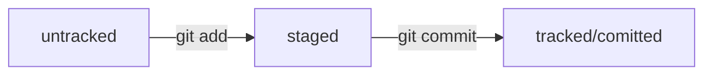

# Краткая инструкция по GIT

## Создание репозитория
* Создать прямо из командной строки
```
echo "# 123" >> README.md
git init
git add README.md
git commit -m "first commit"
git branch -M main
git remote add origin git@github.com:artsharoglazov/123.git
git push -u origin main
```
* Создать в интерфейсе и затем связать с локальным репозиторием

_Создать в интерфейсе репозиторий (желательно с названием таким же как у локального)_
```
git remote add origin git@github.com:artsharoglazov/123.git
git branch -M main
git push -u origin main
```
* Создать в интерфейсе и затем клонировать на локальную машину

_Создать в интерфейсе репозиторий_

`git clone https://github.com/artsharoglazov/name.git`

## Добавление на удаленный репозиторий
```
git add [filename]or[.]or[--all]
git commit -m "note"
git push
```
## Хеш коммита
Содержит информацию об авторе, дате создания коммита а так же обо всех изменеиях файлов и ссылку на предыдущий коммит.
Результат преобразовани указанных параметров функцие SHA-1. 

## Лог
```
git log
git log --oneline
```
## Метка HEAD
Метка HEAD всегда указывает на последний коммит. Сама метка это файл HEAD, корый рамположен *.git/HEAD*. В нем - ссылка на файл *.git/refs/head/brancname*, а в этом файле уже прописан хэш коммита. 

## Схема статусов файла



## Правила написания сообщений к коммитам
Устанавливаются внутри команд. Обычно:
* Длина сообщения не более 72 символов
* Перовое слово - глагол в инфинитиве
* Приналичии задачи в Jira - номер задачи: текст
Можно воспользоваться [Conventional Commits](https://https://www.conventionalcommits.org/ru/v1.0.0-beta.4/#%D1%81%D0%BF%D0%B5%D1%86%D0%B8%D1%84%D0%B8%D0%BA%D0%B0%D1%86%D0%B8%D1%8F) 

## How-To
* Как изменить имя ветки с main на master в локальном и удаленном репозитроии
```
git branch -m master
git branch --unset-upstream
git push --set-upstream origin master
```
